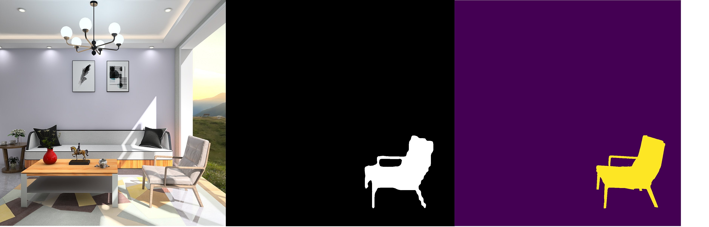
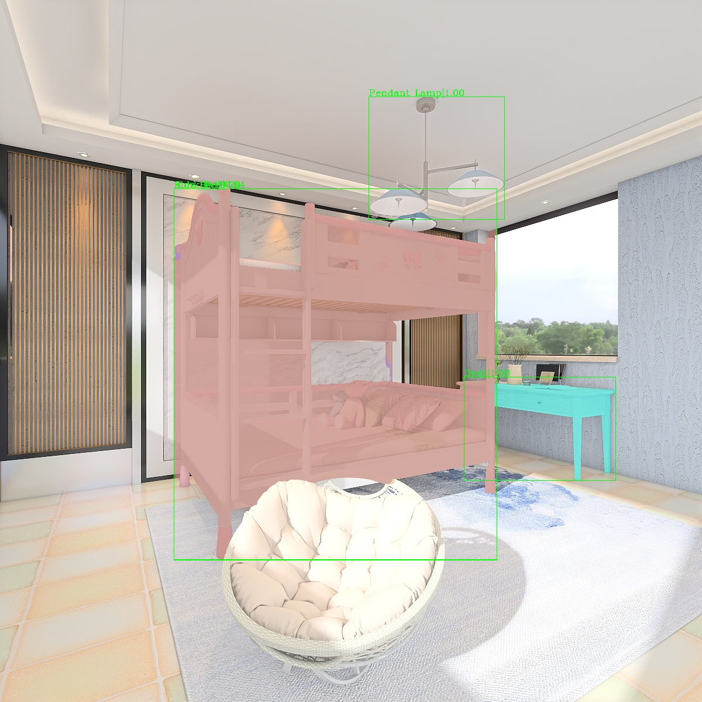
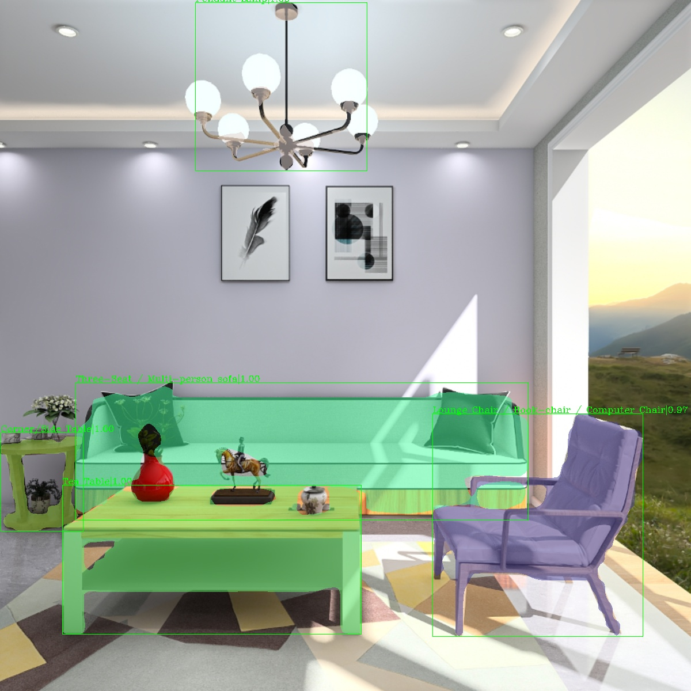
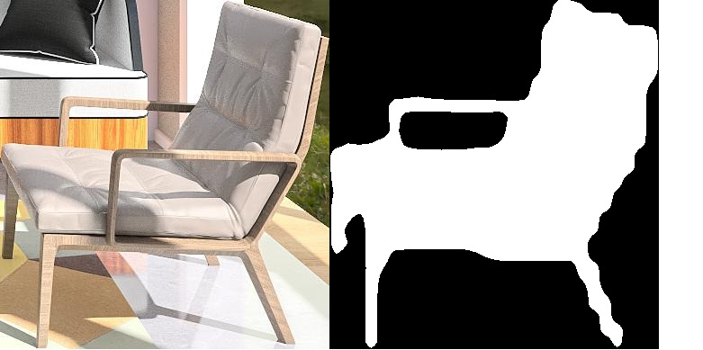
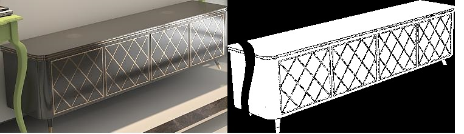
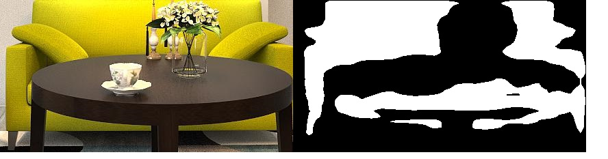

# Background

IJCAI-PRICAI 2020 3D AI Challenge: Instance Segmentation (Instance segmentation for indoor scene) -- 7th place

# Introduction

1.The initial mask is extracted by HTC (Hybrid Task Cascade)

2.Using CascadePSP algorithm for segmentation refinement of initial mask.

# Install

This project use mmdetection and CascadePSP.Go check them out if you don't have them locally installed.

First,for mmdetection installation you can refer to: https://github.com/open-mmlab/mmdetection/blob/master/docs/install.md

Second,for CascadePSP Installation:

```bash
pip install segmentation-refinement
```

# Usage

Our method contain two network to train. One is for getting an initial mask -- HTC. And another is for segmentation refinement -- CascadePSP.


## Demo

The pretrained model for stage1 and stage2 are checkpoints/model_stage_1.pth and weights/model_stage_2.
```
python image_demo.py ${CONFIG_FILE} ${CHECKPOINT_FILE} [optional arguments]
eg: python image_demo.py demo_image/image_3.jpg configs/model.py checkpoint/model_stage_1.pth weights/model_stage_2

```
[optional arguments]:
                     [--model_stage_2 Checkpoint file stage 2] 
					 [--device Device used for inference] 
					 [--score-thr bbox score threshold]

if model_stage_2 is None, it means we don't use segmentation refinement, just use HTC to get the initial mask.

The mask extracted from stage 1 and stage 2


Final result

## Training for HTC

prepare dataset
```
solution
├── mmdet
├── tools
├── configs
├── data
│   ├── annotations
│   │   ├── instances_train.json
│   │   ├── instances_val.json
│   │   ├── instances_test.json
│   ├── train
│   │   ├── 0000000.jpg
│   │   ├── 0000001.jpg
│   │   ├── ...
│   ├── val
│   │   ├── 0050000.jpg
│   │   ├── 0050001.jpg
│   │   ├── ...
│   ├── test
│   │   ├── 0000000.jpg
│   │   ├── 0000001.jpg
│   │   ├── ...

```

Prepare classes
- mmdetection/mmdet/datasets/coco.py CocoDataset
```buildoutcfg
    CLASSES = ("Children Cabinet", "Nightstand", "Bookcase / jewelry Armoire", "Wardrobe", "Tea Table",
               "Corner/Side Table", "Sideboard / Side Cabinet / Console", "Wine Cooler", "TV Stand",
               "Drawer Chest / Corner cabinet","Shelf", "Round End Table", "Double Bed", "Bunk Bed", "Bed Frame",
               "Single bed", "Kids Bed", "Dining Chair", "Lounge Chair / Book-chair / Computer Chair", "Dressing Chair",
               "Classic Chinese Chair", "Barstool", "Dressing Table", "Dining Table", "Desk",
               "Three-Seat / Multi-person sofa", "armchair", "Two-seat Sofa", "L-shaped Sofa", "Lazy Sofa",
               "Chaise Longue Sofa", "Footstool / Sofastool / Bed End Stool / Stool", "Pendant Lamp", "Ceiling Lamp")
```

- mmdetection/mmdet/core/evaluation/class_names.py coco_classes()
```buildoutcfg
    return [
        "Children Cabinet", "Nightstand", "Bookcase / jewelry Armoire", "Wardrobe", "Tea Table",
        "Corner/Side Table", "Sideboard / Side Cabinet / Console", "Wine Cooler", "TV Stand",
        "Drawer Chest / Corner cabinet","Shelf", "Round End Table", "Double Bed", "Bunk Bed", "Bed Frame",
        "Single bed", "Kids Bed", "Dining Chair", "Lounge Chair / Book-chair / Computer Chair", "Dressing Chair",
        "Classic Chinese Chair", "Barstool", "Dressing Table", "Dining Table", "Desk",
        "Three-Seat / Multi-person sofa", "armchair", "Two-seat Sofa", "L-shaped Sofa", "Lazy Sofa",
        "Chaise Longue Sofa", "Footstool / Sofastool / Bed End Stool / Stool", "Pendant Lamp", "Ceiling Lamp"
    ]
```

- mmdetection/mmdet/apis/test.py CLASS_NUM
```buildoutcfg
    CLASS_NUM = 34
```

- mmdetection/mmdet/apis/inference.py CLASS_NUM
```buildoutcfg
    CLASS_NUM = 34
```
**Important**: The default learning rate in config files is for 8 GPUs and 2 img/gpu (batch size = 8*2 = 16).
According to the [Linear Scaling Rule](https://arxiv.org/abs/1706.02677), you need to set the learning rate proportional to the batch size if you use different GPUs or images per GPU, e.g., lr=0.01 for 4 GPUs * 2 img/gpu and lr=0.08 for 16 GPUs * 4 img/gpu.

### Train with a single GPU

```shell
python train_HTC.py ${CONFIG_FILE} [optional arguments]
```

If you want to specify the working directory in the command, you can add an argument `--work_dir ${YOUR_WORK_DIR}`.

### Train with multiple GPUs

```shell
./tools/dist_train.sh ${CONFIG_FILE} ${GPU_NUM} [optional arguments]
```

Optional arguments are:

- `--no-validate` (**not suggested**): By default, the codebase will perform evaluation at every k (default value is 1, which can be modified like [this](https://github.com/open-mmlab/mmdetection/blob/master/configs/mask_rcnn/mask_rcnn_r50_fpn_1x_coco.py#L174)) epochs during the training. To disable this behavior, use `--no-validate`.
- `--work-dir ${WORK_DIR}`: Override the working directory specified in the config file.
- `--resume-from ${CHECKPOINT_FILE}`: Resume from a previous checkpoint file.

Difference between `resume-from` and `load-from`:
`resume-from` loads both the model weights and optimizer status, and the epoch is also inherited from the specified checkpoint. It is usually used for resuming the training process that is interrupted accidentally.
`load-from` only loads the model weights and the training epoch starts from 0. It is usually used for finetuning.

## Test for HTC

Use the cropped image and initial mask as test image for CascadePSP.
```shell
python test_HTC.py ${CONFIG_FILE} ${CHECKPOINT_FILE}[optional arguments]
python test_HTC.py configs/model.py \
    checkpoints/model_stage_1.pth \
    --show-dir result_stage_1
```
Optional arguments are:

- `--out` : output result file in pickle format
- `--save-crop-image`: Whether save crop images,default is True.
- `--show-dir`:directory where painted images will be saved
- ...

result of HTC -- the initial mask demo image:

corresponding cropped image and mask:



Result image will be store at **result_stage_1/**. And corresponding image and mask will be store at  **data/dataset_stage_2/**.

## Training for CascadePSP

Train images for CascadePSP are generated from **train dataset**.(cropped image and mask of groudtruth)
After training for HTC, we get the train images for CascadePSP which are cut-off from the image and mask. 

dataset:
```
solution
├── mmdet
├── tools
├── configs
├── data
│   ├── train_dataset_stage_2
│   │   ├── 0000000.jpg
│   │   ├── 0000000.png
│   │   ├── 0000001.jpg
│   │   ├── 0000001.png
│   │   ├── ...
│   │   ├── ...
│   │   ├── ...
│   ├── test_dataset_stage_2
│   │   ├── 0000000.jpg
│   │   ├── 0000000.png
│   │   ├── 0000001.jpg
│   │   ├── 0000001.png
│   │   ├── ...
│   │   ├── ...
│   │   ├── ...


```
train_dataset_stage_2 contain the cropped train image and groundtruth mask image.
test_dataset_stage_2 contain the cropped test image and initial mask image.
.jpg represent the cropped image and .png represent the corresponding cropped mask image.

train_dataset_stage_2 example


test_dataset_stage_2 example



```
python train_refinement.py ${DATA_PATH} [optional arguments]
eg: python train_refinement.py data/dataset_stage_2 
```
[-i ITERATIONS] [-b BATCH_SIZE] [--lr LR]
                           [--steps [STEPS [STEPS ...]]] [--gamma GAMMA]
                           [--weight_decay WEIGHT_DECAY] [--load LOAD]
                           [--ce_weight CE_WEIGHT CE_WEIGHT CE_WEIGHT CE_WEIGHT CE_WEIGHT CE_WEIGHT]
                           [--l1_weight L1_WEIGHT L1_WEIGHT L1_WEIGHT L1_WEIGHT L1_WEIGHT L1_WEIGHT]
                           [--l2_weight L2_WEIGHT L2_WEIGHT L2_WEIGHT L2_WEIGHT L2_WEIGHT L2_WEIGHT]
                           [--grad_weight GRAD_WEIGHT]
                           id
						   
Weight will be store in **weights/**.


